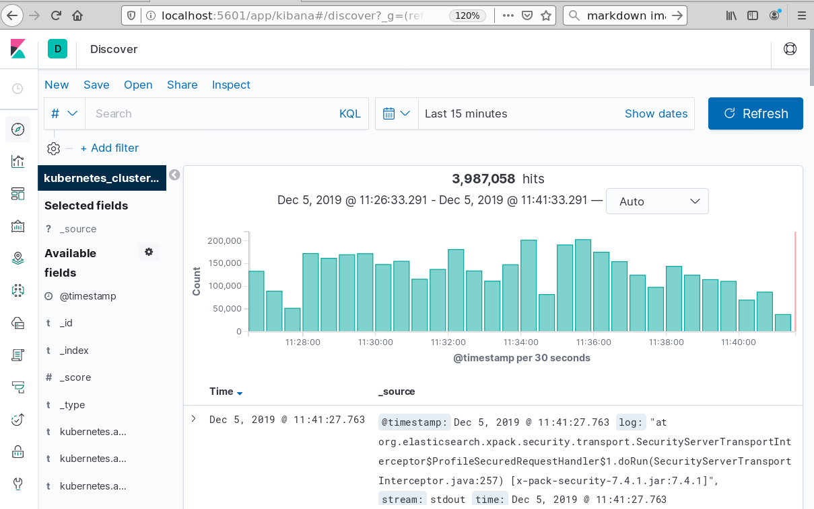

# Platform Operations on Kubernetes (POOK)

This project demonstrates how to set up and Platform Operations infrastructure on Kubernetes by providing a Reference Implementation of many platform level components such as CI, CD, Metrics, Logging, Policy Enforcement and security.

It was designed using Pivotal Container Service (PKS) as the Kubernetes provider with RBAC being provided by UAA, but the default environment should work on any Kubernetes cluster with advanced features like Oauth2/openid integration and DNS/Cert management requiring certain platform pieces provided by the underlying cloud.

We take advantage of a few tools to streamline things, firstly [Helm](https://helm.sh) as all of the infrastructure tooling is available in public Helm charts (although some charts may be vendored in here for custom changes). We use Helmfile to provide a wrapper over helm to allow for more complex installation workflows.

With the goal of doing a gitops style workflow for deploying this, it is expected that you'll have seperate `env` directory(s) containing the customizations for a particular environment or cluster.

For the most part you should just need to edit `envs/default/envs.sh` and fill it in with your details. This is a shell script that will export environment variables to be used by Helmfile. The reason for this is that if you have passwords/secrets you can store them outside of git and have the script extract them from wherever you keep them.

## Prerequisites

It's expected that you already have the basic Kubernetes client tools like `kubectl` installed.

### Helm

* [helm](https://helm.sh/docs/using_helm/#quickstart-guide)
* [helmfile](https://github.com/roboll/helmfile#installation)
* [helmdiff](https://github.com/databus23/helm-diff#install)
* [helm tillerless](https://github.com/rimusz/helm-tiller#installation)

## Example

### default

The default example installs components with their default authentication methods, because of this we do not expose services via `NodePort` or `LoadBalancer` and instead rely on the user running `kubectl port-forward`.

The following components are installed in the default environment:

* Grafana
* Prometheus
* EFK (Elasticsearch, Fluentd, Kibana)
* Concourse
* Harbor
* Minio (for Harbor image storage)


#### Create Kubernetes Cluster

If you don't already have a Kubernetes cluster you should use PKS or GKE to create one.

Wait for cluster to be ready...

Ensure kubectl is working

```bash
$ kubectl get nodes
NAME                                      STATUS   ROLES    AGE   VERSION
vm-5ca56981-6249-4d31-613e-7d84821b245e   Ready    <none>   46m   v1.13.5
vm-5fb78083-d502-43b3-4e01-d664fdb147dc   Ready    <none>   42m   v1.13.5
vm-b451253c-e485-4d99-7bb4-1cfe222bf4ac   Ready    <none>   39m   v1.13.5
```

#### Prepare Helm

Download and Install [Helm 2](https://github.com/helm/helm/releases/tag/v2.15.2).

Install the helm diff and tillerless plugins:

```bash
helm init --client-only

helm plugin install https://github.com/databus23/helm-diff

helm plugin install https://github.com/rimusz/helm-tiller

helm tiller install
```


#### Fill out envs.sh

If you want to customize your deployment copy the contents of `/envs/default` to another location and modify `envs.sh` and `values.yaml` accordingly.

#### Load environment

> Note: If you changed the location of your environment you'll need to modify this command.

```bash
. ./envs/default/envs.sh

```

#### Install using helmfile

```bash
helmfile --state-values-file $ENV_DIR/values.yaml diff
```

#### Check services

##### Grafana

```bash
kubectl -n metrics port-forward svc/grafana 3000
```

Point your web browser at `http://localhost:3000` and then browse to the `cluster-monitoring-for-kubernetes` dashboard.


##### Kibana

> Note: `sudo sysctl -w vm.max_map_count=262144` must be set on your worker nodes for elasticsearch to start correctly. Or you can enable privileged mode which is not recommended.

```bash
kubectl -n logging port-forward svc/kibana-kibana 5601
```

Use `curl` to set a default index pattern

```
curl -XPOST -H "Content-Type: application/json" -H "kbn-xsrf: true" localhost:5601/api/kibana/settings/defaultIndex -d '{"value": "kubernetes_cluster-*"}'
```

Point your web browser at `http://localhost:5601/app/kibana#/discover`



##### Harbor

> Note: You should add an `/etc/hosts` record for `127.0.0.1 harbor`

Forward a port for harbor

```console
kubectl -n harbor port-forward svc/harbor 8443:443
```

Save harbor's CA cert to your local docker config:

```console
sudo su -
mkdir /etc/docker/certs.d/harbor
curl -k https://harbor:8443/api/systeminfo/getcert > /etc/docker/certs.d/harbor/ca.cert
```

Log into registry and push an image:

```console
$ docker login https://harbor:8443
Username: admin
Password: ******
Login Succeeded
```

```console
docker pull alpine:latest
docker tag alpine:latest harbor:8443/library/alpine:latest
docker push harbor:8443/library/alpine:latest
```

Browse to [http://harbor:8443](http://harbor:8443) in your web browser and login using `admin` and `change-me-please` (although you should have changed that password in envs.sh).

You should be able to see your recently pushed alpine image at [https://harbor:8443/harbor/projects/1/repositories](https://harbor:8443/harbor/projects/1/repositories).


##### Concourse

Forward a port for concourse

```console
kubectl -n concourse port-forward svc/concourse-web 8080
```

Browse to [http://localhost:8080](http://localhost:8080) in your web browser and login using `admin` and `change-me-please` (although you should have changed that password in envs.sh).


##### Spinnaker

Forward a port for Spinnaker

```console
kubectl -n spinnaker port-forward svc/spin-deck 9000
```

Browse to [http://localhost:9000](http://localhost:9000) in your web browser.


